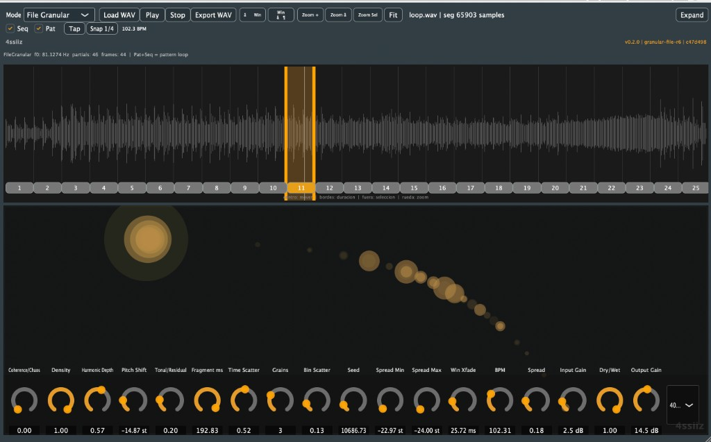

# SpectraMorph — Spectral Particle Instrument

Resíntesis espectral híbrida (tonal + residual) con partículas espectrales autónomas.
Plugin de audio VST3 / AU / Standalone para macOS.



*Modo File Granular: waveform con grilla de pasos, secuenciador Pat/Seq y visualización espectral bajo los controles.*

## Estado — v0.2.0 (Etapa 2)

### Etapa 1 — Live Insert
- STFT, peak detection, partial tracking, resíntesis aditiva + residual
- 4 hilos: Audio / DSP / Simulation / UI
- Uso en Reaper como **inserto** en un track

### Etapa 2 — File Granular
- Carga **WAV** (u otros formatos soportados por JUCE)
- Selector de **segmento** con waveform (drag, zoom, marquee)
- **Grilla de patrón** por ventanas: pasos on/off, **Pat** + **Seq** para loop con saltos
- **Secuenciador de ventanas** con crossfade configurable (`Win Xfade`)
- **Pitch spread** por voz (Spread Min/Max) + **BPM**, **Tap** y **Snap 1/4**
- **Play** preview RT (archivo → `processBlock` → DSP)
- **Export WAV** del segmento procesado
- **TemporalScrambler**: permutación de frames STFT + bin scatter según Coherence/Chaos
- FFT **4096** opcional (Spectral Quality = High)
- Física de simulación de partículas desactivada en este modo; **visualización espectral** (partials del tracker) sí visible en la UI

Tag UI esperado: `v0.2.0 · granular-file-r6 · <git-sha>`

## Modos de procesamiento

| Modo | Entrada | Uso |
|------|---------|-----|
| **Live Insert** | Audio del track | Reaper / DAW en tiempo real |
| **File Granular** | Archivo + segmento | Standalone recomendado; Load → segmento → Play → Export |

### Coherence / Chaos (ambos modos)
- **Coherence bajo** (knob hacia 0): más orden, frames consecutivos, espectro fiel
- **Chaos alto** (knob hacia 1): permutación temporal, bin scatter, textura inconexa con el origen

## Cómo usar — File Granular

1. Abrir SpectraMorph **Standalone** (o VST con UI)
2. Modo: **File Granular**
3. **Load WAV** → arrastrar handles de segmento en la waveform (zoom con rueda o botones)
4. Ajustar Coherence/Chaos, Fragment ms, Time Scatter, Grains, Bin Scatter, Seed
5. Opcional: activar **Pat** + **Seq**, editar pasos en la grilla bajo la waveform, **Tap**/ **Snap 1/4** para BPM
6. **Play** para preview (Dry/Wet según knob)
7. **Export WAV** para guardar el resultado

### UI
- Zona superior: transporte, zoom, **Seq** / **Pat**, Tap / Snap / BPM
- Centro: waveform + grilla de pasos alineada al archivo
- Inferior: **simulación espectral** (partials) con rotativos transparentes encima
- Crédito: **4ssiiz** (esquina superior izquierda)

## Cómo usar — Live Insert

1. Insertar en un track, modo **Live Insert**
2. Reproducir audio del track
3. Ajustar knobs (Gravity/Motion activan simulación de partículas)
4. La visualización de partials/simulación aparece en la zona inferior de controles

## Compilar

```bash
cmake -S . -B build -DFETCHCONTENT_UPDATES_DISCONNECTED=ON
cmake --build build --parallel 2>&1 | tail -15
```

Xcode (debug):

```bash
cmake -G Xcode -S . -B build-xcode -DFETCHCONTENT_UPDATES_DISCONNECTED=ON
open build-xcode/SpectraMorph.xcodeproj
```

Plugins: `~/Library/Audio/Plug-Ins/VST3/SpectraMorph.vst3` y `.component`

## Tests

```bash
cmake --build build --target SpectraMorph_tests
./build/SpectraMorph_tests
```

Incluye: `scrambler_identity`, `scrambler_chaos`, `file_segment_bounds`, `window_pattern`, `tempo_utils`, `pitch_spread` + suite previa.

## Documentación

| Archivo | Contenido |
|---------|-----------|
| SPECS_01 | Visión y teoría |
| SPECS_02 | Audio engine |
| SPECS_03 | Pipeline FFT |
| SPECS_07 | Resíntesis |
| SPECS_11 | Interacción musical |
| **SPECS_13** | **Modo Archivo/Granular (Etapa 2)** |
