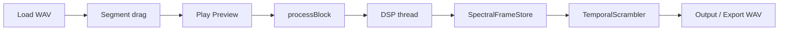

# SPECS_13 — Modo Archivo/Granular (Etapa 2)

## Objetivo

Segunda etapa de SpectraMorph: procesar un **archivo de audio** con selector de segmento (estilo Granular_Synth), preview en tiempo real via `processBlock`, y desorden espectral temporal controlado por **Coherence / Chaos**.

Diferencia con Etapa 1 (Live Insert): prioriza **texturas** y riqueza espectral sobre materia particulada en vivo.

## Flujo

## Coherence vs Chaos (modo archivo)

| Coherence (1 - chaos knob) | Comportamiento |
|---------------------------|----------------|
| >= 0.85 | Frames en orden; sin bin scatter |
| 0.5 - 0.85 | Jitter local de indices de frame |
| < 0.5 | Permutacion de frames por bloques de `temporal_fragment_ms` |
| <= 0.15 | + `bin_scatter` mezcla bins dentro del frame leido |

## Parametros APVTS (modo archivo)

| ID | Descripcion |
|----|-------------|
| process_mode | Live Insert / File Granular |
| segment_start / segment_end | Region normalizada 0-1 |
| temporal_fragment_ms | Tamano de bloque para permutacion |
| bin_scatter | Mezcla intra-frame en caos alto |
| random_seed | Semilla reproducible |
| spectral_quality | FFT 2048 / 4096 |
| export_normalize | Normalizar pico al exportar WAV |

## Limites

- `SpectralFrameStore`: hasta 4096 frames (~21 s @ hop 512 / 48 kHz) o longitud del segmento.
- Simulacion de particulas **desactivada** en File Granular.
- Export requiere plugin preparado (`prepareToPlay` activo en el host).

## Archivos de implementacion

- `src/plugin/FileSourceManager.h`
- `src/dsp/scramble/SpectralFrameStore.h`
- `src/dsp/scramble/TemporalScrambler.h`
- `src/plugin/PluginProcessor.cpp` (rama FileGranular)
