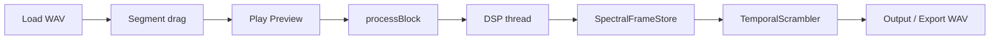

# SPECS_13 — Modo Archivo/Granular (Etapa 2)

## Objetivo

Segunda etapa de SpectraMorph: procesar un **archivo de audio** con selector de segmento (estilo Granular_Synth), preview en tiempo real via `processBlock`, y desorden espectral temporal controlado por **Coherence / Chaos**.

Diferencia con Etapa 1 (Live Insert): prioriza **texturas** y riqueza espectral sobre materia particulada en vivo.

## Flujo

## Coherence vs Chaos (modo archivo)

| Coherence (1 - chaos knob) | Comportamiento |
|---------------------------|----------------|
| >= 0.85 | Frames en orden; sin bin scatter |
| 0.5 - 0.85 | Jitter local de indices de frame |
| < 0.5 | Permutacion de frames por bloques de `temporal_fragment_ms` |
| <= 0.15 | + `bin_scatter` mezcla bins dentro del frame leido |

## Parametros APVTS (modo archivo)

| ID | Descripcion |
|----|-------------|
| process_mode | Live Insert / File Granular |
| segment_start / segment_end | Region normalizada 0-1 |
| window_sequencer | **Seq**: avance automatico al EOF de ventana |
| pattern_enabled | **Pat**: usar grilla (saltar pasos off) |
| pattern_mask | Mascara de pasos activos (int, default -1 = todos) |
| pattern_play_mode | Linear (reservado para fases futuras) |
| window_xfade_ms | Crossfade entre ventanas (50–150 ms) |
| pitch_spread_min / pitch_spread_max | Spread de pitch por voz (semitonos) |
| bpm | Tempo para Snap 1/4 (40–240) |
| temporal_fragment_ms | Tamano de bloque para permutacion |
| temporal_scramble | Time Scatter (mezcla temporal) |
| grain_voices | Numero de voces granulares |
| bin_scatter | Mezcla intra-frame en caos alto |
| random_seed | Semilla reproducible |
| spectral_quality | FFT 2048 / 4096 |
| export_normalize | Normalizar pico al exportar WAV |

Compartidos con Live Insert: coherence_chaos, density, harmonic_depth, pitch_shift, tonal_residual, spread, dry_wet, input_gain, output_gain.

## Secuenciador y grilla

- Cada **ventana** = un segmento de longitud fija dentro del WAV cargado.
- **Seq** solo: avance lineal ventana a ventana.
- **Pat** + **Seq**: al EOF salta al siguiente paso **activo** en la grilla (hasta 32 pasos).
- Click en un paso: toggle on/off y audicion de esa ventana.
- **Win Xfade**: suaviza el salto entre ventanas en preview (no en export offline).

## UI (PluginEditor)

- Waveform con zoom, seleccion marquee y grilla de pasos proporcional al archivo.
- Barra secundaria: Seq, Pat, Tap, Snap 1/4, BPM.
- Zona de controles inferior: simulacion espectral al fondo + rotativos semitransparentes.
- `WindowPatternController.h`, `TempoUtils.h` — logica de grilla y tempo.

## Limites

- `SpectralFrameStore`: hasta 4096 frames (~21 s @ hop 512 / 48 kHz) o longitud del segmento.
- Simulacion de **particulas** (Gravity/Motion/Decay/Spread) **desactivada** en File Granular; el tracker sigue alimentando la visualizacion de partials.
- Export requiere plugin preparado (`prepareToPlay` activo en el host).

## Archivos de implementacion

- `src/plugin/FileSourceManager.h`
- `src/plugin/WindowPatternController.h`
- `src/plugin/TempoUtils.h`
- `src/dsp/scramble/SpectralFrameStore.h`
- `src/dsp/scramble/TemporalScrambler.h`
- `src/plugin/PluginProcessor.cpp` (rama FileGranular)
- `src/plugin/PluginEditor.cpp` (waveform, grilla, simulacion integrada)
